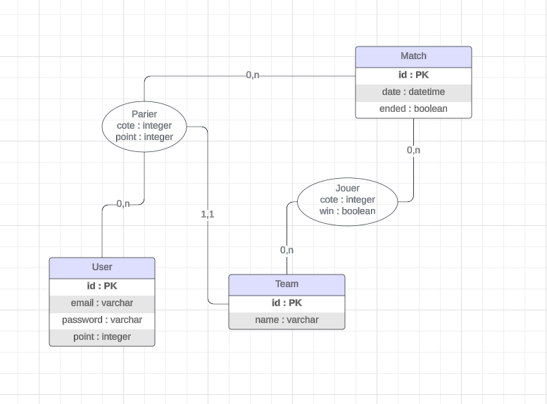

# GamerOdds

## Groupe 

- Enzo Delpy
- Axel Laude
- Aboubacar Nabe

## Description du projet

GamerOdds est une application de pari fictif basé sur la scène E-Sport de Counter Strike 2.   
Elle doit permettre de : 
- S'enregistrer et se connecter avec Google Firebase
- Récupérer les matchs en cours
- Faire un pari 
- Voir son historique de ses paris

Nous avons choisi de faire le projet avec FireAuth pour la connexion ainsi que FireStore pour le stockage des données. Ce choix nous a permit de découvrir et de manipuler pour la première fois une base NoSQL dans un contexte projet.

Pour la récupération des matchs, nous avons utiliser le projet suivant : 
https://www.npmjs.com/package/hltv
Il nous a permit d'élaborer un script qui va récupérer les matchs et qui les envoies dans notre base de données FireStore. 

## Rendus

### Maquettage

Lien vers le figma [ici](https://www.figma.com/file/GYbsazT4G6dlMy7lVa9faD/GamerOdds?type=design&node-id=0%3A1&mode=design&t=R0lsjGJZpntTx5ue-1)

### MCD / UML 

    

### Use Case

Pour la mise d'un pari dans l'application GamerOdds :

    

### Trello 

    

### Vidéo de l'application 

Lien vers la vidéo [ici](https://www.youtube.com/watch?v=gKYdwjYAQMU)

